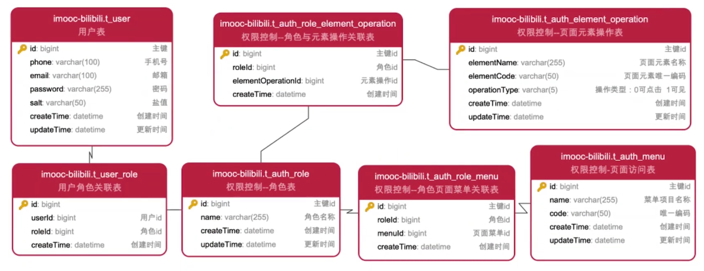
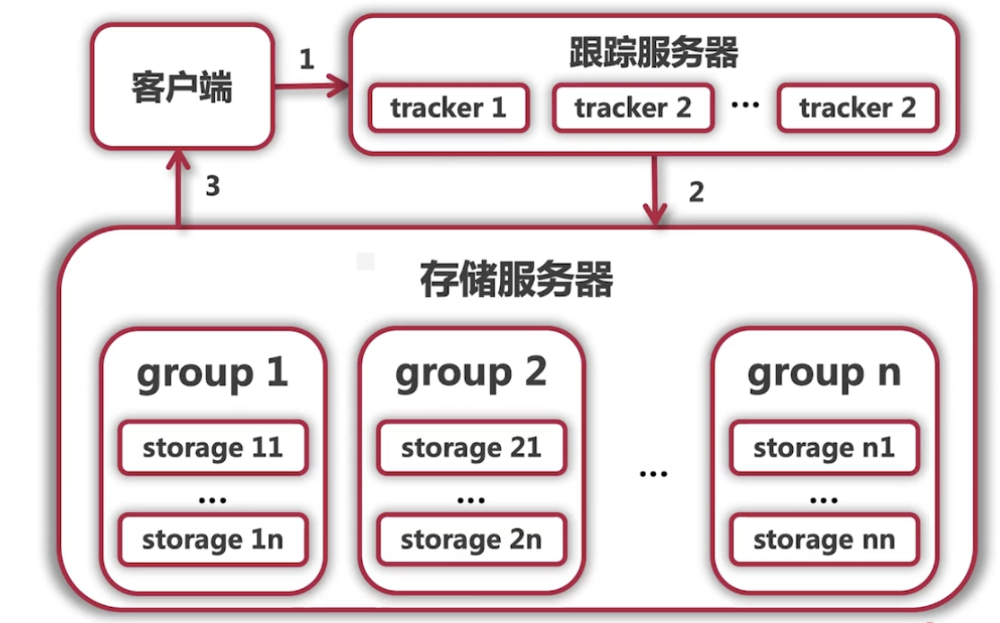
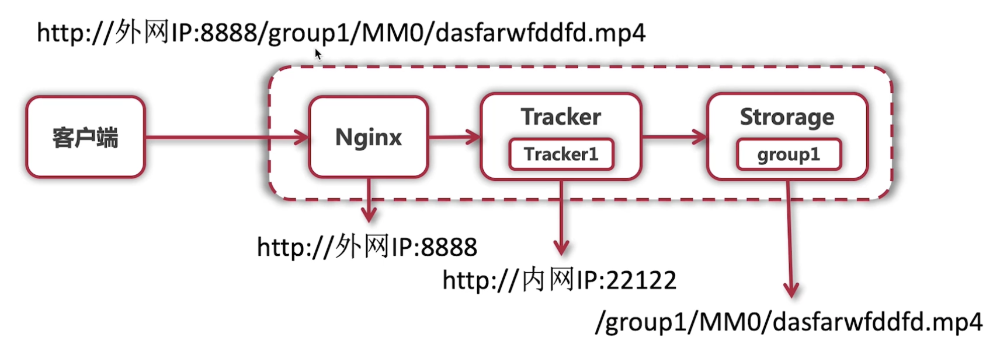

## 1. Development env project start up
1. maven install
2. mysql install and configuration
3. rocketmq-4.9.2 install and configuration

tools

[rocketmq-externals](https://github.com/apache/rocketmq-externals)

5. redis install and configuration
6. redis start up

start redis
```bash
  > redis-server
```
shutdown redis
```bash
  > redis-cli shutdown
```

7. rocketmq topic creation
8. rocketmq start up

cd location
```bash
  > ~/rocketmq-all-4.9.2/distribution/target/rocketmq-4.9.2/rocketmq-4.9.2
```
start name-server
```bash
  > nohup sh bin/mqnamesrv &
  > tail -f ~/logs/rocketmqlogs/namesrv.log
  The Name Server boot success...
```

you should set auto create topic param to `true` at `rockmq bin`

```bash
  > nohup sh bin/mqbroker -n localhost:9876 autoCreateTopicEnable=true &
  > tail -f ~/logs/rocketmqlogs/broker.log 
  The broker[%s, 172.30.30.233:10911] boot success...
```

## 2. Notice
1. Password `123456` convert to encrypted version is `H51gEporH5vQNHeZV+8lGBhkuIac+jQeLBKDJHyfmdoGY3yv2Gjh/yTQJKy7FrwBigauQM945DUS+896oZOBzoXf6PWMVW/6T5S9oB8vYCborJ81FNr3ihJYGBybZDGa+ZMFRvbzeWHXzhrLKab7+czhxRNKlw0Irz6Bf7v1MBo=`
2. Access control `RBAC` : `RBAC0`, `RBAC1`, `RBAC2`, `RBAC3`, includes user, power, resources, role, operation


## 3. Tools
### 3.1 MQ
### 3.2 Redis
### 3.3 FastDFS
> FastDFS is an open source distributed system which can solve storage of big data and load balance problems

Pros: 
1. Support Http protocol to transfer files (combined with Ngnix);
2. Hash the file content to save disk space;
3. It supports load balancing and has good performance.

FastDFS的两个角色分为跟踪服务器（tracker）和存储服务器（storage），当一个前端请求进来的时候，先去找tracker，而不是找storage。因此当有多个tracker的时候就可以形成负载均衡，分别指向其存储服务器。

跟踪服务器：主要做调度工作，起到负载均衡的作用。他是客户端和存储服务器交互的枢纽。

存储服务器：主要提供容量和备份服务，存储服务器是以组（group）为单位，每个组内可以有多台存储服务器，数据互为备份。文件及属性（meta data）都保存在该服务器上。



### 3.4 Nginx
> Nginx是反向代理服务器，代理其实就是中间人，客户端通过代理发送七扭去到互联网上的服务器，从而获取想要的资源。

Pros:
1. 跨平台;
2. 配置简单易上手;
3. 高并发、内存消耗;
4. 稳定性高。

- 正向代理的特点：服务端不知道客户端、客户端知道代理端；
- 
- 反向代理的特点：服务端知道客户端、客户端不知道代理端；
- 

### 3.5 FastDFS + Nginx结合实现文件资源HTTP访问


### 3.6 Mahout协同过滤实现内容推荐
> Mahout是一个开源的分布式机器学习算法的算法库，它是一个基于Java实现的可扩展的、高效的推荐引擎

- Mahout常用推荐算法：基于用户的推荐、基于内容的推荐

推荐算法步骤：
1. 收集用户偏好数据，用户的偏好数据可以体现在多种操作行为上，如点赞、收藏、转发、是否购买等；
2. 数据降噪与归一化处理：不同偏好维度的数据需要进行数据降噪与归一化处理来处理形成统一的偏好得分；
3. 算出相似物品或者用户：基于用户的推荐、基于内容的推荐。

基于用户的推荐：
1. 核心思想：推荐和此用户相似的用户喜欢的内容；
2. 本质是基于用户对内容的偏好找到相邻的相似用户，然后将相似用户喜欢的内容推荐给当前用户。

基于物品的推荐：
1. 核心思想：推荐和此用户喜欢内容的相似内容给该用户；
2. 本质是基于用户对内容的偏好找到相似的内容，然后依据用户的历史行为偏好，推荐相似的内容给用户。

### 3.7 Jenkins + Git + Maven的自动化部署
> 通过git获取项目代码，使用maven打包成可执行的jar包，通过jenkins推送到应用服务器并执行远程启动脚本

Jenkins
1. Jenkins是一个开源的基于Java的持续集成工具；
2. Jenkins的主要功能：监控外部调用执行工作、持续的软件版本发布（自动化）。

### 3.8 Spring Cloud
- 如今互联网开发的普遍要求:高并发\大数据\快响应；
- 应对高并发、大数据、快响应的解决方案：分布式开发；
- 分布式开发研发成本高、周期长，大部分企业很难开发自己的分布式框架；
- Spring Cloud为企业提供了套免费且开源的解决方案；
- Spring Cloud是一套组件，如服务治理和发现、配置中心、消息总线、负载均衡、断路器和数据监控等；

基于Eureka的服务治理和发现
- 服务治理和发现：在Spring Cloud中使用Eureka实现服务治理；

客户端负载均衡
- 客户端负载均衡：微服务间调用时需要使用负载均衡提供一个节点进行响应，负载均衡是分布式必须实施的方案；
- 负载均衡体现了Spring Cloud的高可用特点；
- Spring Cloud提供了Ribbon来实现负载均衡。但是Ribbon的使用较为繁琐，因此Spring Cloud提供了接口式的声明服务调用方式，也就是Feign。

断路器
- 断路器：在分布式中，因存在网络延迟或者故障，大量的服务调用可能导致调用者和被调用者瘫痪，Spring Cloud引入Hystrix来处理这个问题；
- Hystrix会对故障的服务进行处理，这类似于电路负载过大，保险丝会烧毁从而保障用电安全一样，所以称之为断路器；
- 这样，当消费者长期得不到服务提供者的响应时，就可以进行降级、服务短路、线程和信号隔离、请求缓存或者合并处理。

API网关
- API网关：Spring Cloud中的API网关是Zuul；
- API网关有两个作用：一个请求地址映射真实地址，另一个是过滤恶意攻击与无效请求；
- 同时实现了服务端的负载均衡及过滤器的作用。